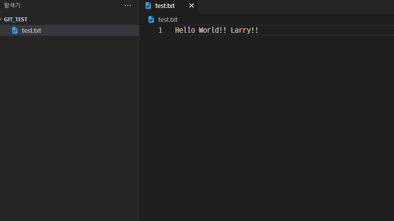

# 20230503 강의 - git 사용 안내

## git 깃허브에서 받아오기

이 문서에서는 git을 이용해 깃허브에서 프로젝트를 받아오는 방법에 대해 다룹니다.

1. 깃허브에서 프로젝트 주소 복사하기
    - 깃허브 웹사이트에서 받아오려는 프로젝트를 선택합니다.
    - 프로젝트 주소를 복사합니다.
2. 터미널에서 git clone 명령어 입력하기
    - 터미널을 열어 프로젝트를 받아올 디렉토리로 이동합니다.
    - `git clone` 명령어를 입력합니다.
    - 복사한 프로젝트 주소를 붙여넣기 합니다.
    - 예시: `git clone <https://github.com/user_name/project_name.git`>
3. 프로젝트 다운로드 확인하기
    - 다운로드가 완료되면 해당 디렉토리에 프로젝트가 생성됩니다.
    - `ls` 명령어를 이용해 디렉토리 내 파일을 확인할 수 있습니다.

이제 깃허브에서 프로젝트를 받아오는 방법을 알게 되었습니다.

내용 바꾸기

## git 스테이지에 올리기

1. git add 명령어를 이용해 파일을 스테이지에 추가합니다.
    - 예시: `git add <file_name>`
2. `git status` 명령어를 이용해 추가된 파일을 확인합니다.
3. git commit 명령어를 이용해 스테이지에서 변경 사항을 커밋합니다.
    - 예시: `git commit -m "commit message"`
4. 변경 사항을 push하여 원격 저장소에 업로드합니다.
    - 예시: `git push`

## git 스테이지에 올리기

1. `git add .` 명령어를 이용해 모든 파일을 스테이지에 추가합니다.
2. `git status` 명령어를 이용해 추가된 파일을 확인합니다.
3. `git commit` 명령어를 이용해 스테이지에서 변경 사항을 커밋합니다.
    - 예시: `git commit -m "commit message"`
4. 변경 사항을 push하여 원격 저장소에 업로드합니다.
    - 예시: `git push`

새로운 파일 추가

## git 파일 추가하는 여러 방법

1. `git add <file_name>` : 특정 파일만 스테이지에 추가합니다.
2. `git add .` : 모든 파일을 스테이지에 추가합니다.
3. `git add -A` : 삭제된 파일까지 모두 스테이지에 추가합니다.

추가한 파일을 커밋하고 push하는 방법은 이전 섹션에서 설명하였습니다.

## git 초기 설정

1. git의 버전 정보를 설정합니다.
    - 예시: `git config --global user.name "사용자 이름"`
    - 예시: `git config --global user.email "이메일 주소"`
2. 로컬 저장소를 초기화합니다.
    - 예시: `git init`

이제 git 초기 설정을 완료했습니다.

## git github에 올리기

1. Github 웹사이트에서 새로운 repository를 생성합니다.
2. `git remote add origin <repository 주소>` 명령어를 이용해 local repository와 remote repository를 연결합니다.
    - 예시: `git remote add origin <https://github.com/user_name/repository_name.git`>
3. `git add .` 명령어를 이용해 모든 파일을 스테이지에 추가합니다.
4. `git commit -m "commit message"` 명령어를 이용해 변경 사항을 커밋합니다.
5. `git push -u origin main` 명령어를 이용해 변경 사항을 remote repository에 업로드합니다. 
`git push -u` 명령어는 git push를 실행할 때, 원격 저장소의 브랜치와 같은 이름의 브랜치가 있다면 자동으로 해당 브랜치를 업데이트합니다. 이후로는 `git push` 명령어만 입력해도 브랜치를 업데이트할 수 있습니다.

이제 git으로 Github에 프로젝트를 업로드하는 방법을 알게 되었습니다.

커밋 이력을 보면서 프로그램적으로 복습할 수 있다.

[README.md](http://readme.md/) 파일은 프로젝트의 소개와 사용 방법, 문제 해결 방법 등을 설명하는 프로젝트 설명서입니다. 보통 깃허브 저장소의 루트 디렉토리에 위치하며, 프로젝트를 처음 접하는 사람들이 이 파일을 통해 프로젝트를 쉽게 이해할 수 있도록 작성됩니다.
